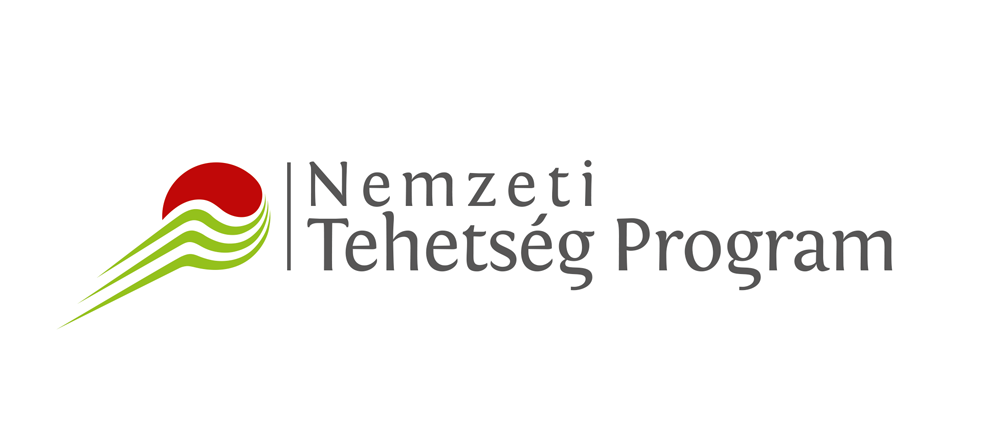

# ntp_python
 Programming (python) material for NTP program.

Some good materials are the followings:
- in depth explanation of the syntax and concepts http://nyelvek.inf.elte.hu/leirasok/Python/
- programming concepts in Python https://infopy.eet.bme.hu/
- biology specific usage of Python http://userpages.fu-berlin.de/digga/p4b.pdf

0. - setting up Anaconda environment and GitHub

1. - introduction
- basic phylosophy (import this)
    - form of communication
- 'Hello world!'
    - print() statement
- string data type
    - indexing (0 based, reversing), slicing, replace, split
    - .find()
        - + len(string)
    - special characters as strings ('\n', '\t')
- declare variable
- special statements
    - is, in, and, or, ==, !=
- string methods https://www.w3schools.com/python/python_ref_string.asp
- string methods with some examples https://www.geeksforgeeks.org/python-string-methods/
- variable decalaration https://www.w3schools.com/python/python_variables.asp

2. - data types 1
- recap str (.find())
- conditional statements
    - if, elif, else
- int
    - as return value of len()'s
- float
    - special float ('nan'), rounding
- using type() function
- type conversions vica versa
- conditional statements https://realpython.com/python-conditional-statements/
- type conversion https://www.geeksforgeeks.org/type-conversion-python/

3. - data types 2
- list
    - indexing, mutability, append function, inserting
    - nested list
        - len()
        - indexing
- dictionary
    - structure, indexing?, mutability
    - other data types combined with dictionary
    - {key:value} vs dictionary[key] = value
- use of dictionaries in biology https://open.oregonstate.education/computationalbiology/chapter/dictionaries/
- use of dictionaries in biology https://www.badgrammargoodsyntax.com/compbio/2017/9/13/004-practical-python-for-biologists-use-dictionaries

4. - iteration
- syntax
    - head, body
- controlling mechanisms
    - range, pass, continue, break
- indexing inside loop
    - enumerate
- for loops https://www.w3schools.com/python/python_for_loops.asp
- loops https://www.geeksforgeeks.org/loops-in-python/

5. - working with files
- with open
    - "extensions" --> w,a, def
- os module (path.join, listdir)
    - general module importings
    - using with iteration
- raw string on Windows
- filepath relativization
    - LINUX/MAC style, home_dir definition
- working with files section in the Python for biologists book http://userpages.fu-berlin.de/digga/p4b.pdf
- sum of working with files https://realpython.com/working-with-files-in-python/

6. - define own functions
- syntax
- simplest function (input = output)
- return
- global variables
- recursive function calling
- https://realpython.com/defining-your-own-python-function/
- https://www.w3resource.com/python/python-user-defined-functions.php
- https://www.geeksforgeeks.org/python-user-defined-functions/

7. - data types 3
- arrays and array functions
- dataframes

8. - data types 4
- pandas
    - csv specific function, vectorizing
- the power of vectorized code https://www.youtube.com/watch?v=EEUXKG97YRw&t=440s

9. - exception handling (try/except structure)
- https://docs.python.org/3/tutorial/errors.html
    
10. - object orinted programming
- classes
- instances
- oop in Python https://www.youtube.com/watch?v=8yjkWGRlUmY&t=0s

11. - visualization
- basic matplotlib plots
- https://jakevdp.github.io/PythonDataScienceHandbook/04.00-introduction-to-matplotlib.html
- https://www.analyticsvidhya.com/blog/2021/02/an-intuitive-guide-to-visualization-in-python/#:~:text=Matplotlib%20is%20a%20visualization%20library,%2C%20scatter%2C%20histogram%2C%20etc.
- https://towardsdatascience.com/data-visualization-using-matplotlib-16f1aae5ce70

12. - calculus
- differentiation with sympy
    - symbolic derivative
    - numeric derivative
- https://www.youtube.com/watch?v=DeeoiE22bZ8&t=569s
